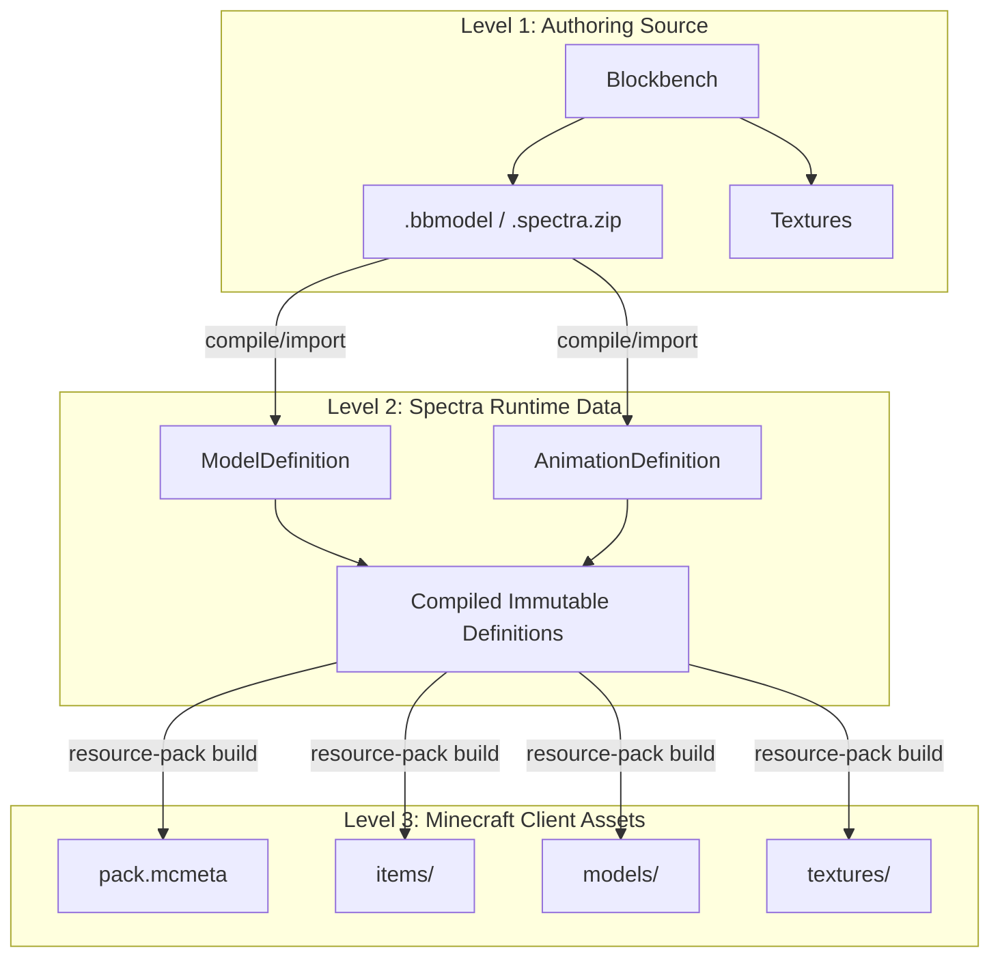

# The SpectraEvents Asset Pipeline

SpectraEvents provides a fully automated pipeline that bridges the gap between 3D artist workflows (Blockbench) and the final Minecraft client resource pack.

## Three Layers of Assets

Understanding the pipeline requires distinguishing between **source assets**, **runtime data**, and **generated output**.

### Level 1: Authoring Source
These are the files actively edited by asset authors.
- **Location**: `.bbmodel` source files, `.spectra.zip` bundles, or YAML configuration definitions.
- **Rule**: This is the canonical source of truth. Always make changes here.

### Level 2: Spectra Runtime Data
When source assets are imported, they are compiled into `ModelDefinition` and `AnimationDefinition` objects.
- **Location**: Internal registry in memory, backed by definitions in `plugins/SpectraEvents/models/` and `plugins/SpectraEvents/animations/`.
- **Role**: Drives the server-side behavior, logic, bounding boxes, and animation keyframes.

### Level 3: Minecraft Client Assets (Generated Output)
When the pipeline builds the resource pack, it outputs a valid Minecraft zip.
- **Location**: Generated `pack.mcmeta`, `models/`, `items/`, `textures/` in the cache directory.
- **Rule**: **Do NOT hand-edit the generated JSON files or resource pack.** Any manual edits here will be overwritten on the next pipeline build. Modify Level 1 and rebuild.

---

## Official vs Custom Assets

SpectraEvents clearly separates the official baseline content from custom server additions.

### Official Assets
Official assets (e.g., Meteor, Airdrop, Metin) are published by the SpectraEvents maintainer directly to the **SpectraEvents Assets** Modrinth project.
- Servers use the `ModrinthResourcePackSource` configuration.
- The pipeline downloads the pre-built, correct resource pack version from the Modrinth CDN automatically.
- Server owners **do not** need to download ZIPs manually, host them on S3/Cloudflare, or deal with `server.properties` resource-pack hashes.

### Custom Server Assets
If an administrator wants to add custom models (e.g., `custom_boss.bbmodel`, server logo), these **do not** go to the official Modrinth project.
- Administrators use the `ManualUrlResourcePackSource` configuration.
- Custom packs must be hosted on the administrator's own web server or CDN.
- The server configures the `url` and `sha1` explicitly in the plugin config.
